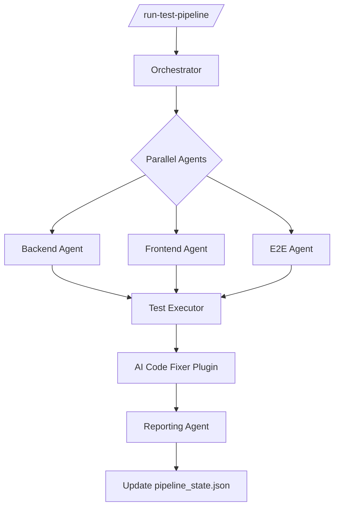

# System Diagram with AI Code Fixer

```mermaid
flowchart TD

A[/run-test-pipeline/] --> B[Orchestrator]

B --> C{Parallel Agents}
C --> D[Backend Agent]
C --> E[Frontend Agent]
C --> F[E2E Agent]

D --> G[Test Executor]
E --> G
F --> G

G --> H[AI Code Fixer Plugin]

H --> I[Reporting Agent]
I --> J[Update pipeline_state.json]
```
